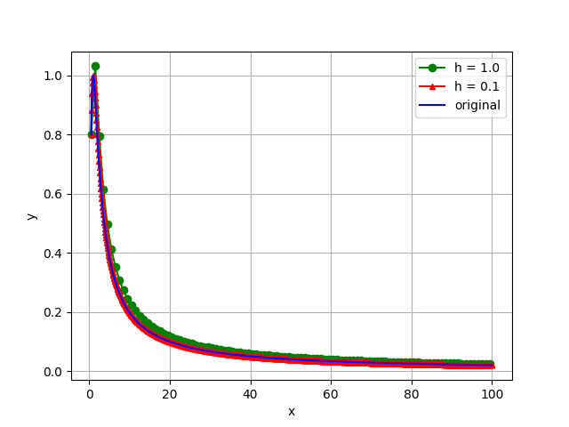

### Индивидуальное домашнее задание №1 по дисциплине «Дифференциальные уравнения»

#### Работу выполнил: бакалавр 1 курса, Кожинов Павел Сергеевич, группы O3143

#### Преподаватель: Бабушкин Максим Владимирович

#### Вариант №8

**Условия:** 

Написать программу, решающую задачу Коши y ′ = f(x, y), y(x0) = y0 на отрезке [x0, X] методом Рунге-Кутты 4-го порядка с шагом h. Программа должна считывать значения переменных X и h из файла in.txt, а построенную таблицу значений выводить в файл out.txt. Решить также поставленную задачу аналитически. Построить три графика: график точного решения, график приближённого решения с шагом h, и график приближённого решения с шагом h/10.

**Исходные данные:**

` `

**Аналитическое решение:**

	

**Графики:**

***График №1: График функции, полученный при шаге h=1, X=100***

***График №2: График функции, полученный при шаге h=0.1, X=100***

` `***График №3: График исходной функции X=100***

***График №4: Все 3 графика, наложенных друг на друга***

**

**Вывод:**

Графики, полученные в результате решения задачи методом Рунге-Кутты совпадают с графиком исходной функции, из чего можно сделать вывод, что написанный код работает корректно и задача, поставленная в начале данного задания, была выполнена.
